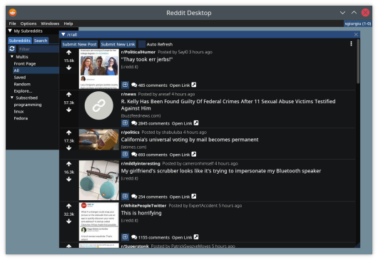
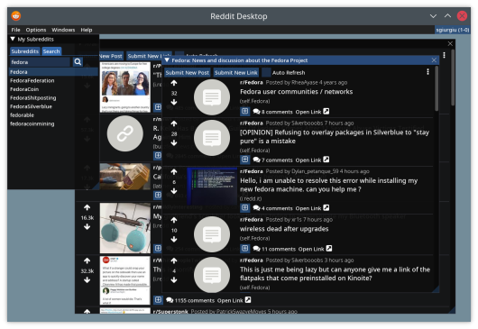
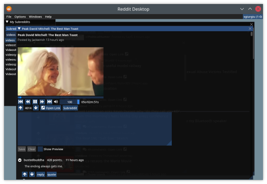

# Reddit Desktop

**Reddit Desktop** is a desktop client for [reddit](https://reddit.com).

To download the latest release for your OS, please visit the [releases](https://github.com/sgiurgiu/reddit_desktop/releases/latest) page.

For Windows, download the .msi executable, which will provide you with a package, ready to be installed.

For Linux, download the `*-debian.deb` package for Debian based distributions or the `*-fedora.rpm` package
for Fedora, and install them with your package manager (`sudo apt install <deb file>` or `sudo dnf install <rpm file>`).

For Fedora you will also need to install a repository that provides libmpv, such as rpmfusion. For example:
```
dnf install -yq \
    http://download1.rpmfusion.org/free/fedora/rpmfusion-free-release-stable.noarch.rpm \
    http://download1.rpmfusion.org/nonfree/fedora/rpmfusion-nonfree-release-stable.noarch.rpm && \
    rpm --import /etc/pki/rpm-gpg/RPM-GPG-KEY-rpmfusion-free-fedora-latest && \
    rpm --import /etc/pki/rpm-gpg/RPM-GPG-KEY-rpmfusion-nonfree-fedora-latest
```

If you would rather run the container image (docker or podman), download the `reddit_desktop_runtime.tar.gz` file from the releases page. Load it for your container (e.g. `podman load -i reddit_desktop_runtime.tar`) then run it with
```
mkdir -p ~/.config/reddit_desktop

podman run --rm -v ~/.config/reddit_desktop:/root/.config/reddit_desktop \
        -v /tmp/.X11-unix:/tmp/.X11-unix --security-opt=label=type:container_runtime_t \
         -e DISPLAY -v /run/user/$(id -u)/:/run/user/0/   -e XDG_RUNTIME_DIR=/run/user/0 \
        -e PULSE_SERVER=/run/user/0/pulse/native \
        --ipc host \
        localhost/reddit_desktop_runtime
```
The `docker/run_container.sh` script provides an example.

## Screenshots







## Build it from source

### Prerequisites
- Git
- A C++20 capable compiler (does not need to be fully compliant)
- Cmake 3.18+
- VcPkg
- LibMPV

### Setup your development environment
 - Windows
   - Install VS2019 (can be Community edition) with the C++ Support package
   - Install prerequisites (git, cmake, ninja, wixtoolset, powershell-core)
   - One simple powershell script to install everything via Chocolatey:
        ```
        Set-ExecutionPolicy Bypass -Scope Process -Force; iex ((New-Object System.Net.WebClient).DownloadString('https://chocolatey.org/install.ps1'))

        choco feature enable -n allowGlobalConfirmation
        choco -y install 7zip.install
        choco -y install git.install
        choco -y install cmake.install --installargs 'ADD_CMAKE_TO_PATH=System'
        choco -y install ninja 
        choco -y install wixtoolset 
        choco -y install powershell-core
        ```
   - Install vcpkg (assuming the vcpkg folder will be `E:\projects\vcpkg`. Change as desired.)
        ```
        New-Item -ItemType Directory -Force -Path E:\projects\
        cd E:\projects\
        git clone https://github.com/Microsoft/vcpkg.git
        cd vcpkg
        .\bootstrap-vcpkg.bat
        ```
    - Install libmpv for windows prebuilt DLL, and youtube-dl.exe
        ```
        New-Item -ItemType Directory -Force -Path E:\projects\mpv
        cd E:\projects\mpv

        #Download latest youtube-dl.exe release
        $youtube_dl_latest_uri = "https://api.github.com/repos/ytdl-org/youtube-dl/releases/latest"
        $latestYoutubeDlRelease = Invoke-RestMethod $youtube_dl_latest_uri
        $latestYoutubeDlReleaseAssets = $latestYoutubeDlRelease.assets
        $latestYoutubeExeAsset = $latestYoutubeDlReleaseAssets | where-object {$_.name -EQ "youtube-dl.exe" }
        Invoke-WebRequest $latestYoutubeExeAsset.browser_download_url -OutFile "$pwd\$($latestYoutubeExeAsset.name)"

        # Download the latest release from libmpv folder, manually
        Start-Process https://sourceforge.net/projects/mpv-player-windows/files/libmpv/

        ```
        Download mpv-dev-x86_64-<latest release>.7z from that sourceforge page. Extract it somewhere (E:\projects\mpv).
        Then in that mpv folder, from a VS2019 Developer command prompt run : `lib /dev:mpv.def /machine:x64 /out:mpv.lib`
    - Done with windows. Wasn't that hard now, was it? 
 - Linux Debian 11 (and Debian based distributions)
    ```
    apt install -y dpkg build-essential cmake gcc g++ git \
                libmpv-dev ca-certificates curl zip unzip tar libglu1-mesa-dev libgl1-mesa-dev \
                pkg-config generate-ninja ninja-build libxmu-dev libxi-dev libgl-dev
    ```
  - Linux Fedora (34+) 
    ```
    dnf install -yq \
    http://download1.rpmfusion.org/free/fedora/rpmfusion-free-release-stable.noarch.rpm \
    http://download1.rpmfusion.org/nonfree/fedora/rpmfusion-nonfree-release-stable.noarch.rpm && \
    rpm --import /etc/pki/rpm-gpg/RPM-GPG-KEY-rpmfusion-free-fedora-latest && \
    rpm --import /etc/pki/rpm-gpg/RPM-GPG-KEY-rpmfusion-nonfree-fedora-latest
    ```
    ```
    dnf -yq install cmake gcc g++ pkgconf-pkg-config git \
        tar rpm-build ninja-build perl-FindBin perl-English perl-File-Compare \
        ibus-devel libXmu-devel libXi-devel mesa-libGL-devel mesa-libGLU-devel \
        mpv-libs-devel
    ```

### Actually building the executable
`cd <projects folder>`

`git clone --recurse-submodules https://github.com/sgiurgiu/reddit_desktop.git`

- Linux

    `mkdir build && cd build`

    `cmake -GNinja -DCMAKE_TOOLCHAIN_FILE=<vcpkg folder>/vcpkg/scripts/buildsystems/vcpkg.cmake -DCMAKE_BUILD_TYPE=Release -DENABLE_TESTS=OFF -DENABLE_M4DC=ON -DENABLE_CMARK=OFF <git cloned folder>`

    `ninja`

    And now run it from that folder with `src/reddit_desktop`

- Windows
  ```
    cmake -B . -S <git cloned folder> -G Ninja -DCMAKE_TOOLCHAIN_FILE=<vcpkg folder>/vcpkg/scripts/buildsystems/vcpkg.cmake -DVCPKG_TARGET_TRIPLET=x64-windows-static -DENABLE_TESTS=False -DCMAKE_BUILD_TYPE=Release -DCPACK_GENERATOR=WIX -DLIBMPV_DIR="<libmpv folder>" -DLIBMPV_INCLUDE="<libmpv include folder>" -DYOUTUBE_DL="<youtube-dl.exe path>"
    cmake --build .
  ```

The scripts that build it on windows and linux can be found in the `scripts` folder, as well in the `docker` folder. Those scripts are the authority when it comes to the process of building a package for a particular OS
should this readme not be updated.


---

This application uses the [Dear ImGui](https://github.com/ocornut/imgui) library for its UI. Big thanks to [ocornut](https://github.com/ocornut) and all the other contributors for their amazing work.
